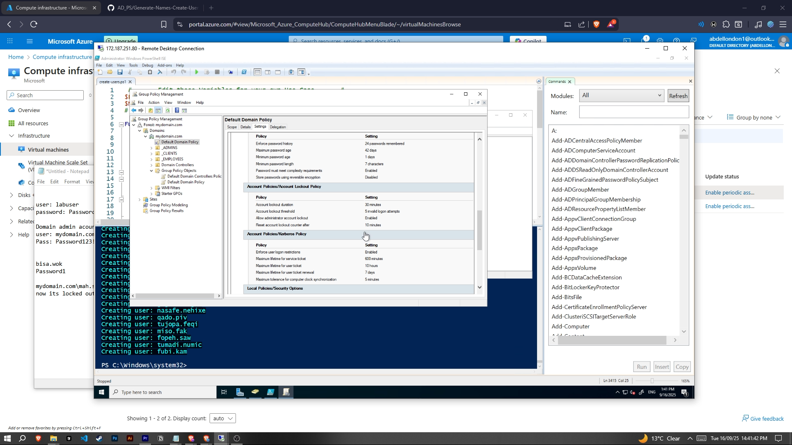

<h1>On-premises Active Directory Deployed in the Cloud (Azure)</h1>
This tutorial outlines the implementation of on-premises Active Directory within Azure Virtual Machines. 

<h2>Video Demonstration</h2>

- ### [YouTube: How to Deploy on-premises Active Directory within Azure Compute](https://www.youtube.com/watch?v=0EBat1N3BiE)

<h2>Environments and Technologies Used</h2>

- Microsoft Azure (Virtual Machines/Compute)
- Remote Desktop
- Active Directory Domain Services (AD DS)
- PowerShell
- Group Policy

<h2>Operating Systems Used </h2>

- Windows Server 2022
- Windows 10 (21H2)

<h2>High-Level Deployment and Configuration Steps</h2>

- Spin up VMs in Azure (Infrastructure)
- Deploy Active Directory (Domain Controller)
- Create & Manage Users (PowerShell)
- Apply Policies & Permissions (Group Policy)
- Account Management & Validation

<h2>Deployment and Configuration Steps</h2>

<strong>Step 1: Spin up VMs in Azure</strong> 
Create a Windows Server VM (Domain Controller) and a Windows 10 Client VM within the same virtual network using Azure portal.

 

<strong>Step 2: Deploy Active Directory</strong> 
Install Active Directory Domain Services (AD DS) on the Windows Server VM and promote it to a Domain Controller by creating a new forest/domain.

 

<strong>Step 3: Create & Manage Users</strong> 
Use PowerShell to create individual and bulk Active Directory user accounts, then confirm their presence in Active Directory Users & Computers (ADUC).

 

<strong>Step 4: Apply Policies & Permissions</strong> 
Use Group Policy Management to create and apply policies (e.g., password complexity, desktop restrictions) to organizational units (OUs).

 

<strong>Step 5: Account Management & Validation</strong> 
Log in as newly created users to confirm they are authenticated by Active Directory and that applied Group Policies are enforced.

 

## 🤳 Connect with me

<a href="https://www.linkedin.com/in/abdel-b-893256362/">LinkedIn</a>
